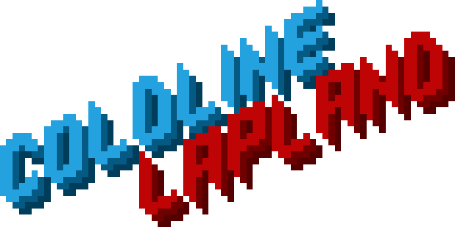

Our submision for the three thing games game jam at the university of hull

Itch.io page: [ColdLine Lapland](https://tcrier2022.itch.io/coldline-lapland-ttg)

The premice of three thing game is that you are given 3 words and t=you need to make a game based around those words. Our words were: Lights, Mincepie and carollers.
We thought up of a topdown shooter in which you use a shotgun filled with mincepies to shoot at the most annoying parts of Christmas loud carollers and bundles of ligts that cant be untangled. We drew heavy inspiration from hotline miami hence the name of our game.

[I](https://github.com/Kisielekw) proggramed all of the game using unity

[Thomas](https://github.com/OneGingerBiscuit) Created the level and the art for the game

and [Kai](https://github.com/KEDW02) Came up with most of the ideas we implomented

